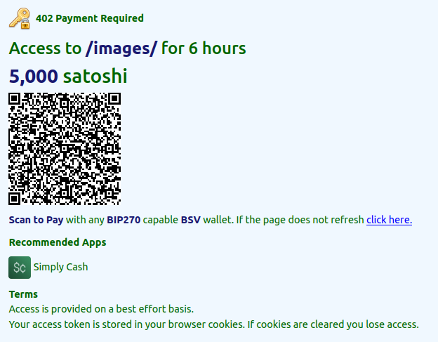
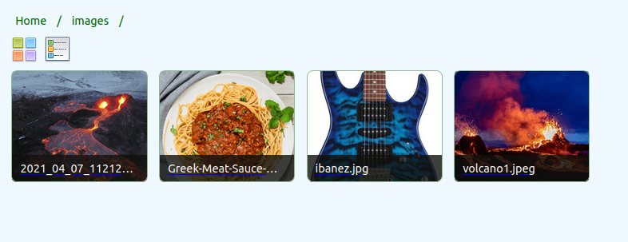

### The site has been configured with the pricelist file below:
```
# pricelist.json
{
  "pricelist": [
    { 
      "pattern": "/images", 
      "amount": 5000, 
      "description": "The best images folder ever!" 
    }
  ]
}    
```

### When the user visits the `/images` url, they are required to make a payment:  


### When the payment is made, content is displayed:  
